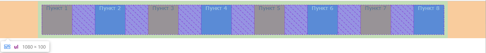

### Данные
- _ul_ - с внутренним отступом в `10px` и внешними отступами слева и справа в `100px`;
- размеры элементов списка `80x80`;
- цвета элементов списка:
  - нечетные: фон `#E76D13`, текст черный;
  - четные: фон `#3255c9`, текст белый.

### Необходимо
Расположить все элементы списка по центру страницы, растянув по ширине.

